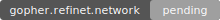

# REFInet Pillar



> Sovereign Gopher mesh node. Your cryptographic identity. Your node. Your internet.

**Protocol v0.3.0** | **479 tests passing** | **AGPLv3 License** | **Python 3.9+**

---

## Install in 30 Seconds

| Method | Command |
|--------|---------|
| **pip** | `pip3 install refinet-pillar[full] && refinet-pillar run` |
| **Docker** | `docker-compose up -d` |
| **systemd** | `sudo bash deploy/install.sh` |
| **Gopher** | `curl gopher://gopher.refinet.io:7070/1/download` |
| **Source** | `pip3 install -r requirements.txt && python3 pillar.py` |

---

## What Is This?

REFInet Pillar turns any computer into a **sovereign mesh node** in Gopherspace. There is no central server. No accounts to create on someone else's platform. Your Pillar is your identity, your node, and your piece of the network.

Each Pillar is:
- A **Gopher server** serving signed content on TCP port 7070 (+ optional port 70)
- A **cryptographic identity** (Pillar ID / PID) built on Ed25519
- A **mesh participant** discovering neighbors via UDP multicast and replicating registries
- A **local ledger** tracking all transactions in SQLite (13-month live + yearly archive)
- A **browser bridge** connecting wallets via SIWE (EIP-4361) and WebSocket
- A **gateway** to 5 EVM chains via built-in RPC proxy
- A **Tor hidden service** (optional) for anonymous .onion access

---

## Architecture

```
+--------------------------------------------------+
|               REFInet Pillar Node                 |
+-----------+-----------+------------+--------------+
|  Gopher   |  SQLite   |   PID &    |  Mesh + SIWE |
|  Server   |  Ledger   |  Crypto    |  Discovery   |
| TCP:7070  | Live+Arc  | Ed25519    |  Multicast   |
+-----------+-----------+------------+--------------+
|       DApp Runtime + EVM RPC Gateway (5 chains)   |
+---------------------------------------------------+
|     Browser Extension v0.4.0 (WebSocket Bridge)   |
+---------------------------------------------------+
|  Encrypted Vault | ZKP Auth | Shamir Recovery     |
+---------------------------------------------------+
|  Transport: Wi-Fi Mesh / LAN / Internet / Tor     |
+---------------------------------------------------+

Ports: 7070 (REFInet) | 70 (Gopher) | 7073 (TLS) | 7074 (Proxy) | 7075 (WebSocket)
```

---

## Download

| Channel | Location |
|---------|----------|
| **GitHub** | [github.com/circularityglobal/REFINET-PILLARS](https://github.com/circularityglobal/REFINET-PILLARS) |
| **PyPI** | `pip install refinet-pillar` |
| **Docker Hub** | `docker pull refinet/pillar:latest` |
| **Gopherspace** | `gopher://gopher.refinet.io:7070/download` |

---

## Docker Quick Start

```bash
docker run -d \
  -p 7070:7070 -p 70:70 -p 7075:7075 \
  -v ~/.refinet:/home/refinet/.refinet \
  refinet/pillar:latest
```

Or with docker-compose:

```bash
git clone https://github.com/circularityglobal/REFINET-PILLARS.git
cd REFINET-PILLARS
docker-compose up -d
```

---

## Browser Extension

The REFInet Pillar Bridge (v0.4.0) connects your browser to your local Pillar:

1. Open `chrome://extensions` and enable Developer Mode
2. Click "Load unpacked" and select the `browser-extension/` directory
3. Click the REFInet icon and authenticate with your Ethereum wallet

Features: SIWE authentication, EIP-6963 multi-wallet support, `window.refinet` API for DApps.

---

## CLI Reference

```bash
pillar.py run [--host HOST] [--port PORT] [--no-mesh] [--no-gopher] [-v]
pillar.py --status
pillar.py hole create|list|verify
pillar.py peer add|list|remove
pillar.py profile create|list|switch|info|delete
pillar.py recovery split|restore
```

---

## Documentation

- [Getting Started](GETTING-STARTED.md) — Full setup guide with all options
- [Platform Overview](PLATFORM_OVERVIEW.md) — Architecture deep dive
- [Developer Guide](DEV_GUIDE.md) — Module reference and API docs
- [Whitepaper](WHITEPAPER.md) — Protocol specification
- [Security Policy](SECURITY.md) — Vulnerability reporting
- [Contributing](CONTRIBUTING.md) — How to contribute
- [Code of Conduct](CODE_OF_CONDUCT.md) — Community standards
- [Changelog](CHANGELOG.md) — Release history

---

## Project Structure

```
refinet-pillar/
├── pillar.py                # Entry point, async launcher, CLI
├── requirements.txt         # Python dependencies
├── pyproject.toml           # PyPI packaging
├── Dockerfile               # Container image
├── docker-compose.yml       # One-command deployment
├── core/                    # Gopher server, menu builder, config
├── crypto/                  # Ed25519 PID, signing, ZKP
├── db/                      # SQLite ledger (live + archive)
├── auth/                    # SIWE, sessions, encrypted vault
├── mesh/                    # Peer discovery, replication
├── rpc/                     # EVM JSON-RPC gateway (5 chains)
├── cli/                     # CLI subcommands
├── proxy/                   # Privacy proxy (SSRF-protected)
├── integration/             # Cross-module integration
├── scripts/                 # Deployment & release scripts
├── tests/                   # 479 tests across 33 modules
├── browser-extension/       # Chrome extension v0.4.0
├── gopherroot/              # Served Gopher content
├── deploy/                  # systemd service + install script
├── docs/                    # Wire formats, backup guide
└── fly.toml                 # Fly.io deployment config
```

---

## Contributing

See [CONTRIBUTING.md](CONTRIBUTING.md) for the full guide. Quick version:

1. Fork the repository
2. Create a feature branch: `git checkout -b feature/your-feature`
3. Run the test suite: `python -m pytest tests/ -q`
4. Submit a pull request

See [SECURITY.md](SECURITY.md) for vulnerability reporting and [CODE_OF_CONDUCT.md](CODE_OF_CONDUCT.md) for community standards.

---

## License

AGPLv3 — See [LICENSE](LICENSE) for full text.

---

## Connect to the Mesh

Add the bootstrap node to `~/.refinet/peers.json`:

```json
[
  {
    "hostname": "gopher.refinet.io",
    "port": 7070,
    "pid": "REPLACE_WITH_64_CHAR_HEX_PID_FROM_KEYGEN",
    "public_key": "REPLACE_WITH_64_CHAR_HEX_PUBKEY_FROM_KEYGEN",
    "pillar_name": "REFInet Bootstrap Pillar"
  }
]
```

---

Run a Pillar. Join the mesh.
